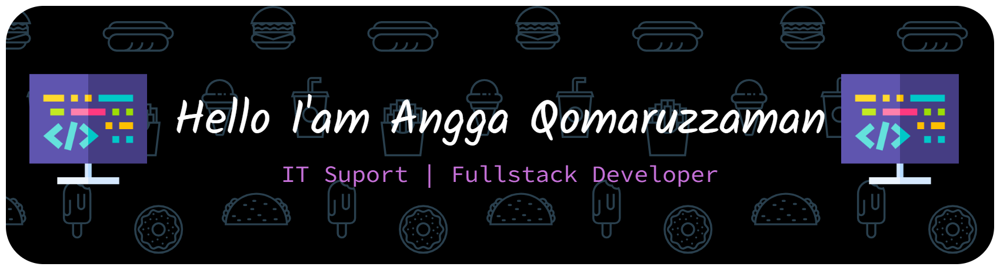

# Hi World!!
Halo pak nama saya **Angga Qomaruzzaman** mahasiswa smester 1 Fakultas **Teknik Informatika di Universitas Pelita Bangsa**. Saat ini, Saya sedang bekerja di salah satu perusahaan sebagai IT Support dan tertarik untuk switch career sebagai software developer

👜 I'm currently working on **PT. Kyroaku Blowmolding Indonesia** As an **IT Support**

📕 I'm currenly learn golang & typescript

⚙ my skills programming languages is Vanilla Javascript, [**ReactJs**](https://react.dev/) + [**VueJs**]((https://vite.dev/guide/)), [**NodeJs**](https://nodejs.org/en), [**HTML**], [**CSS**], [**Bootstrap**](https://getbootstrap.com/), and [**Tailwind**](https://tailwindcss.com/).

🧩 Experience in develop learning web app in harisenin.com with ReactJs + VueJs and Tailwind css.

